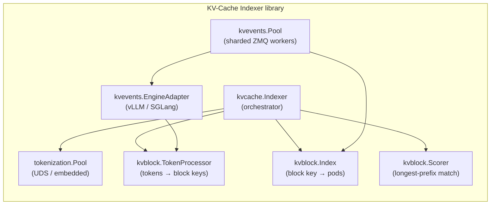
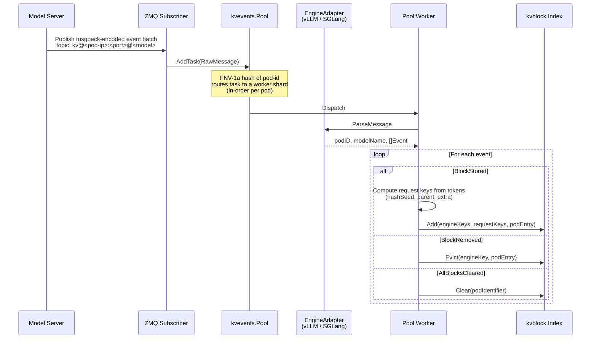
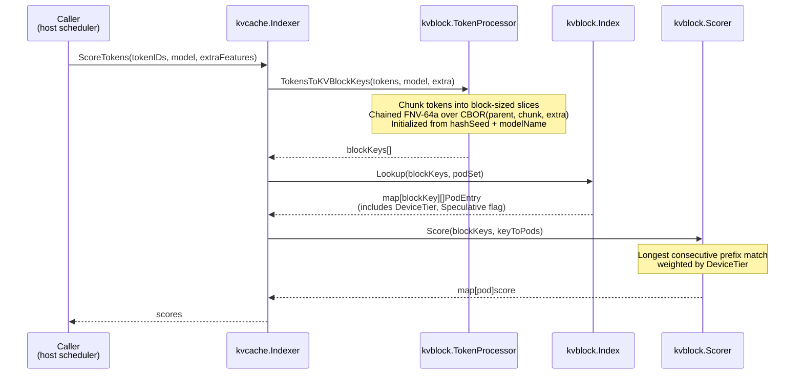

# KV-Cache Indexer: Architecture

The **KV-Cache Indexer** is a Go library that maintains a near-real-time, globally consistent view of KV-Cache block residency across a fleet of model-server pods. It subscribes to KV-Events emitted by the model servers (vLLM and SGLang today) and exposes a fast scoring API that ranks pods by how much of a request's prefix they already have cached.

The library is designed to be embedded in a host process (llm-d's EPP is the reference consumer); it is not a standalone service.

-----

## System Architecture

The indexer is built from several modules with separated concerns:

| Module | Purpose | Default Implementation |
|:---|:---|:---|
| `kvcache.Indexer` | Orchestrator — coordinates block-key computation, index lookup, and scoring. | — |
| `kvblock.TokenProcessor` | Converts a token sequence into a deterministic list of block keys. Reproduces each engine's chained FNV-64a over CBOR content-addressing scheme. | — |
| `tokenization.Pool` | Worker pool for rendering and tokenizing prompts. Sources tokenizers from a UDS sidecar, from local files, or from HuggingFace Hub. | — |
| `kvblock.Scorer` | Computes per-pod scores from block keys and lookup results. | Longest consecutive prefix match, weighted by device tier. |
| `kvblock.Index` | The block index itself. Pluggable interface storing `requestKey → []PodEntry` plus the auxiliary `engineKey → requestKey` map. | Two-level in-memory LRU. |
| `kvevents.Pool` | Sharded worker pool that consumes ZMQ messages, orders them per-pod (FNV-1a on pod ID), and applies them to the index. | — |
| `kvevents.EngineAdapter` | Parses engine-specific wire formats into domain events. | vLLM (msgpack) and SGLang (msgpack) adapters ship today. |



The library has two primary data flows: the **Write Path** for ingesting cache events, and the **Read Path** for scoring pods.

-----

## Write Path: Ingesting KV-Events

Model servers publish three event types over ZMQ whenever their KV-cache state changes:

- **`BlockStored`** — blocks with the given content hashes have been created on a specific device tier. Payload includes the chained parent hash, the token chunk, any LoRA ID/name, and any multimodal extra keys.
- **`BlockRemoved`** — blocks with the given hashes have been evicted from a specific device tier and/or attention group.
- **`AllBlocksCleared`** — the pod dropped its entire cache (a reset). This can occur during RL weight rollouts and other scenarios. The indexer drops all entries associated with the pod via a reverse `pod → request keys` index.



**Key steps:**

1. **Event publication** — a model-server pod emits an event (e.g. `BlockStored`) when its cache changes. The event is published to a ZMQ topic of the form `kv@<pod-ip>:<port>@<model>`.
2. **Message reception** — the `zmqSubscriber` receives the raw message without parsing engine-specific formats.
3. **Sharded queuing** — the `kvevents.Pool` uses `EngineAdapter.ShardingKey()` to extract the pod identifier and FNV-1a-hash it to select a worker queue. This guarantees events from the same pod are processed in order.
4. **Engine-specific parsing** — a worker calls `EngineAdapter.ParseMessage()` to decode the engine-specific payload into a batch of generic events.
5. **Index update** — the worker applies each event to the index.

### The Dual-Key Design

At scoring time the indexer must answer *"given this prompt, which pods have its prefix cached?"* using only the prompt's tokens — it cannot round-trip to a model server. So it uses its own hashes over tokens (**request keys**) as the primary index.

Model servers, however, identify blocks using their own internal content-addressing hashes (**engine keys**). These are what appear in KV-Events. The indexer cannot derive an engine key from a prompt, and it cannot derive a request key from an engine key — the two hash spaces are independent.

This creates a problem on eviction: `BlockRemoved` events carry only the engine key. The indexer must figure out which request key to remove from its scoring index. The solution is to build the bridge on ingestion:

- `BlockStored` events carry the token chunk, so the worker can compute the request key from tokens *and* record an `engine_key → request_key` mapping.
- `BlockRemoved` events use that mapping to find the request key, then evict it.
- Scoring never touches engine keys — it computes request keys from the prompt and looks them up directly.

```
  BlockStored (engine_key=E1, tokens=[...])
  ┌──────────────────────────────────────────────┐
  │  worker computes request_key R1 from tokens  │
  │                                              │
  │  stores:  R1 → PodEntry{pod, tier}           │  ← scoring lookups use this
  │  stores:  E1 → R1                            │  ← eviction lookups use this
  └──────────────────────────────────────────────┘

  BlockRemoved (engine_key=E1)
  ┌──────────────────────────────────────────────┐
  │  looks up:  E1 → R1                          │
  │  evicts:    R1 → PodEntry{pod, tier}         │
  └──────────────────────────────────────────────┘

  Score(prompt tokens)
  ┌──────────────────────────────────────────────┐
  │  computes request_keys [R0, R1, R2, ...]     │
  │  looks up each Rn → []PodEntry               │  ← engine keys not involved
  └──────────────────────────────────────────────┘
```

-----

## Read Path: Scoring a Request

The scorer's goal is to find the length of the **longest consecutive prefix** of the request's block sequence cached in each candidate pod.



KV-cache blocks form a chain where block `i` depends on all blocks `0..i-1`. Due to the causal nature of attention, a server can reuse a cached block only if it holds the unbroken prefix leading up to it.

For example, consider a prompt with block keys `[B0, B1, B2, B3, B4]` and three candidate pods:

```
Block keys:   B0    B1    B2    B3    B4

Pod A:        yes   yes   yes   yes   no    → score = 4 blocks
Pod B:        yes   yes   no    -     -     → score = 2 blocks (chain breaks at B2)
Pod C:        no    -     -     -     -     → score = 0 blocks (no prefix)
```

Even if Pod C happened to hold `B3` and `B4`, those entries are unusable without the preceding chain, and the score is zero.

When blocks are stored across memory tiers, each matching block's contribution is weighted by tier. For a block cached on multiple tiers at once, the scorer takes the maximum weight. Defaults are `gpu = 1.0`, `cpu = 0.8`.

-----

## Event Delivery Modes

Two shapes are supported for getting events from the model servers to the indexer:

- **Centralized** — every model-server pod connects (`zmq.PUB`) to a single endpoint hosted by the host process (`zmq.SUB`). Simpler to configure; works naturally with a single host replica.

```
  Model Server A ──► ZMQ ──┐
  Model Server B ──► ZMQ ──┼──► Host (binds tcp://*:5557)
  Model Server C ──► ZMQ ──┘
```

- **Pod discovery** — each model-server pod binds its own ZMQ socket; the host process discovers pods via Kubernetes label selectors and creates per-pod subscribers. This mode supports active-active multi-replica deployments — each replica independently subscribes to every pod and sees the full event stream.

```
  Host Replica 1 ──ZMQ──┐
                        ├──► Model Server A (binds :5557)
  Host Replica 2 ──ZMQ──┤
                        ├──► Model Server B (binds :5557)
  Host Replica 1 ──ZMQ──┤
                        └──► Model Server C (binds :5557)
  Host Replica 2 ──ZMQ──┘
```

-----

## Block Index Backends

The `kvblock.Index` is the hot data structure of the system: every scoring call queries it, every KV-event updates it. The interface is pluggable with multiple backends:

| Backend | Storage | When to use | Tradeoff |
|:---|:---|:---|:---|
| **In-Memory** (default) | Two-level LRU (`hashicorp/golang-lru`): outer cache keyed by block hash, inner cache of pods per block. | Default choice for most deployments. | Lowest latency; fixed entry count (default 100M keys × 10 pod entries) makes sizing predictable. |
| **Cost-Aware Memory** | Ristretto cache with admission control and cost-based eviction. | Workloads where per-entry size varies significantly (multimodal, variable-length LoRA metadata). | Budget specified in bytes (e.g. `2GiB`) rather than entry count; probabilistic admission can reject entries under pressure. |
| **Redis / Valkey** | External server over TCP. Valkey is Redis-wire-compatible and BSD-licensed. | Deployments that need persistent or very-long-lived index state (uncommon — KV-cache state is ephemeral). | Adds a network hop per lookup and ties host availability to the external store. Shared state gives strong consistency across replicas, but is rarely necessary since each in-memory replica converges from the event stream. Valkey supports experimental RDMA transport. |

> [!IMPORTANT]
> In-memory is typically the best option: low latency, simple operations, and high availability via multi-replica deployment. Each replica in pod-discovery mode subscribes to every model-server's events independently and converges to the same index.

**Sizing.** In-memory backends size independently per replica; plan for roughly `keys × pod_entries` with overhead for the two-level LRU. The cost-aware backend is easier to bound because you specify a byte ceiling; it is the safer choice when per-entry size is hard to predict. For Redis / Valkey, the key space is proportional to unique blocks across the fleet, not to request volume.

-----

## Component Deep Dives

### Engine Adapter Pattern

The `kvevents.EngineAdapter` interface provides an abstraction that decouples the event processing pipeline from engine-specific message formats:

```go
type EngineAdapter interface {
    // ParseMessage parses a raw transport message into domain data.
    ParseMessage(msg *RawMessage) (podID, modelName string, batch EventBatch, err error)

    // ShardingKey extracts the key used to shard messages across worker queues.
    ShardingKey(msg *RawMessage) string
}
```

Adapters shipping today:

- **`VLLMAdapter`** — parses `kv@<pod-ip>:<port>@<model-name>` topic strings and decodes msgpack-encoded event batches. Maps vLLM event tags to `BlockStored` / `BlockRemoved` / `AllBlocksCleared`.
- **`SGLangAdapter`** — parses SGLang's event format (also msgpack-encoded).

### KV-Block Hashing

To look up blocks by request keys, the indexer reproduces the engine's content-addressing scheme:

- **Token chunking**: prompts are converted to tokens, grouped into fixed-size chunks (configurable via `blockSize`; default 16).
- **Hash algorithm**: a chained hash is computed. Each block's key is an **FNV-64a** hash over the CBOR-encoded tuple `[parentHash, tokenChunk, extra]`.
- **Initialization**: the hash chain starts with a configurable `hashSeed` mixed with the model name.
- **Extra parameter**: the third component enables cache differentiation:
  - `nil` — standard prompts.
  - `int` — LoRA adapter ID.
  - `string` — adapter name or content-affecting identifier.
  - `map` — structured metadata (e.g. multimodal content hashes).

Different `extra` values produce different block hashes, preventing cache pollution when the same tokens are used with different adapters or multimodal inputs.

> [!NOTE]
> Engine keys and request keys have been **decoupled** since [#202](https://github.com/llm-d/llm-d-kv-cache/pull/202). The indexer no longer requires alignment between its `hashSeed` and vLLM's `PYTHONHASHSEED` — it maintains its own request-key space and bridges to engine keys on ingestion (see [The Dual-Key Design](#the-dual-key-design) above).

### Multimodal, LoRA, and Hybrid Attention

Many deployment patterns cache KV blocks based on more than text. The indexer supports these by folding additional features into block keys:

- **Multimodal** — per-block multimodal content hashes are folded into the block-key chain. vLLM emits an `extra_keys` field on `BlockStored` events (bare multimodal hash strings in v0.18+, legacy `[hash, offset]` tuples before), which the adapter parses into `BlockExtraFeatures`. The same feature is computed on the read side by walking the multimodal placeholders in the tokenized prompt. Two prompts identical in text but differing in image content hash differently and route independently.
- **LoRA** — on `BlockStored`, if a `LoraName` is present, it is used in place of the base model name when deriving block keys. Different adapters produce different key chains for the same token sequence, and cache hits are correctly scoped to the adapter.
- **Hybrid attention** (*target design — work in progress*) — hybrid models partition the KV-cache into layer groups (full, sliding-window, linear/state-space) that evict independently. For a single token range, full-attention blocks can still be resident while sliding-window blocks have rolled out of the attention window — the same "prefix" is cached in one group but not in another. Scoring for hybrid models therefore needs to classify each prefix match as **full**, **partial**, or **miss**, using the model's window sizes to decide whether a partial hit is still routable. Today's `kvblock.Scorer` does not yet make this distinction — it performs consecutive prefix matching weighted by device tier. Extending the event format and scorer for hybrid-aware classification is tracked in [#336](https://github.com/llm-d/llm-d-kv-cache/issues/336).
- **Data-parallel (DP) ranks** (*work in progress*) — in DP deployments, each rank owns a distinct KV-cache. vLLM tags every event with a `data_parallel_rank`, but the pool currently ignores it: for deployments where each rank runs in its own vLLM process, the rank can be assigned at the subscription/connection level; for shared-frontend deployments, the rank must flow through into the index entries so routing can target the correct rank. Closing this gap alongside the wide-EP work is tracked in [#357](https://github.com/llm-d/llm-d-kv-cache/issues/357).

### Speculative Entries

The index supports **speculative entries**: short-lived entries inserted before a confirming `BlockStored` event arrives, used by callers (e.g. a scheduler) to close the blind spot between a routing decision and the engine's event.

Characteristics:

- Entries carry a `Speculative: true` flag and participate in scoring exactly like confirmed entries.
- Each caller-registered set of speculative entries is tracked in a TTL cache (caller-configurable). On expiry, if no confirming `BlockStored` has arrived, the entries are evicted.

The library exposes the primitive; the policy (when to insert, what TTL) is decided by the caller.

### Tokenization Subsystem

Efficient tokenization matters because the Read Path computes request keys synchronously per request. The system uses a worker pool with a composite tokenizer:

- **`tokenization.Pool`** — supports both synchronous (for scoring requests — complete results required) and asynchronous (fire-and-forget) modes.
- **Tokenizer backends**:
  - **`CachedLocalTokenizer`** — loads tokenizers from local files. Useful for air-gapped environments, custom tokenizers, or pre-loaded models. Supports manual mapping, auto-discovery of HuggingFace cache layouts (`models--org--model/snapshots/{hash}/tokenizer.json`), and custom directory structures.
  - **`CachedHFTokenizer`** — downloads and caches tokenizers from HuggingFace. Wraps HF's Rust tokenizers and maintains an LRU cache of active instances.
  - **`CompositeTokenizer`** (default) — tries backends in order, falling back from local to HuggingFace. Best of both worlds: fast local access when available, remote fetching otherwise.
- **Caching** — all tokenizer backends maintain an LRU of loaded tokenizer instances to avoid repeated disk loads.

The library can also be driven by an **external tokenizer sidecar** over a Unix domain socket, in which case the internal `tokenization.Pool` is not used. This is the recommended setup for production deployments (isolates tokenizer downloads and Python dependencies from the host process).

-----

## Dependencies

The indexer relies on several external libraries:

- **Tokenization** — HuggingFace Rust tokenizers via Go bindings (embedded path), or an external tokenizer sidecar over UDS (recommended for production).
- **[go-zeromq/zmq4](https://github.com/go-zeromq/zmq4)** — pure-Go ZeroMQ implementation used by the event processing pool. Does not require `libzmq` on the host.

-----

## See Also

- [Configuration reference](configuration.md) — all JSON-serializable configuration fields.
- [Deployment examples](deployment/) — example Helm values and offline publisher utilities.
